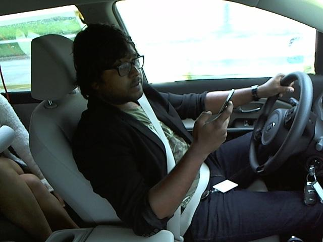
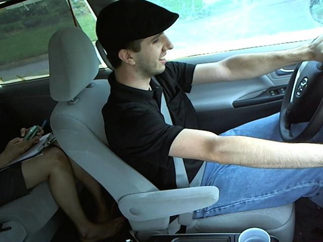
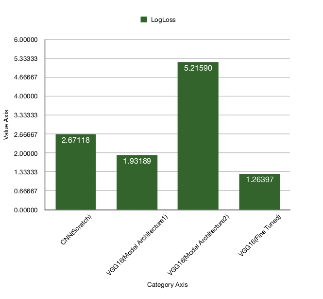

# Distracted Driver Detection


## Applying on Input Video


## Applying on Input Image


## Project Overview

According to the CDC motor vehicle safety division, one in five car
accidents is caused by a distracted driver. Sadly, this translates to 425,000
people injured and 3,000 people killed by distracted driving every year.

In this project, I have created and refined machine learning models to detect
what the driver is doing in a car given driver images. This is done by
predicting the likelihood of what the driver is doing in each picture. 

## Problem Statement

Given a dataset of 2D dashboard camera images, an algorithm needs to be
developed  to classify each driver's behaviour and determine if they are
driving attentively, wearing their seatbelt, or taking a selfie with their friends in
the backseat etc..? This can then be used to automatically detect drivers
engaging in distracted behaviours from dashboard cameras.

Following are needed tasks for the development of the algorithm:

1. Download and preprocess the driver images

2. Build and train the model to classify the driver images

3. Test the model and further improve the model using different techniques.

## Data Exploration

The provided data set has driver images, each taken in a car with a driver
doing something in the car (texting, eating, talking on the phone, makeup,
reaching behind, etc). This dataset is obtained from Kaggle(State Farm
Distracted Driver Detection competition).

Following are the file descriptions and URL’s from which the data can be
obtained :
* imgs.zip - zipped folder of all (train/test) images
* sample_submission.csv - a sample submission file in the correct format
* driver_imgs_list.csv - a list of training images, their subject (driver) id, and
* class id
* driver_imgs_list.csv.zip
* sample_submission.csv.zip

The 10 classes to predict are:

* c0: safe driving

* c1: texting - right

* c2: talking on the phone - right

* c3: texting - left

* c4: talking on the phone - left

* c5: operating the radio

* c6: drinking

* c7: reaching behind

* c8: hair and makeup

* c9: talking to passenger

There are 102150 total images. Of these 17939 are training images,4485
are validation images and 79726 are training images. All the training,
validation images belong to the 10 categories shown above.
The images are
coloured and have 640 x 480 pixels each as shown below  

Driver texting right  
  

Driver operating the radio  


## Project Overview

### Data Preprocessing

Preprocessing of data is carried out before model is built and training process
is executed.
Following are the steps carried out during preprocessing.
* Initially the images are divided into training and validation sets.
* The images are resized to a square images i.e. 224 x 224 pixels.
* All three channels were used during training process as these are color
images.
* The images are normalised by dividing every pixel in every image by 255.
* To ensure the mean is zero a value of 0.5 is subtracted.

### Implementation

A standard CNN architecture was initially created and trained. We have created 4 convolutional layers with 4
max pooling layers in between. Filters were increased from 64 to 512 in each
of the convolutional layers. Also dropout was used along with flattening layer
before using the fully connected layer. Altogether the CNN has 2 fully
connected layers. Number of nodes in the last fully connected layer were
setup as 10 along with softmax activation function. Relu activation function
was used for all other layers.Xavier initialization was used in each of the
layers.

### Refinement

To get the initial result simple CNN architecture was built and evaluated. This
resulted in a decent loss. The public score for the initial simple CNN
architecture(initial unoptimized model) was 2.67118.
After this to further improve the loss, transfer learning was applied to VGG16
along with investigating 2 types of architectures for fully connected layer.
Model Architecture1 showed good results and was improved further by using
the below techniques
* Drop out layer was added to account for overfitting.
* Xavier initialization was used instead of random initialization of weights
* Zero mean was ensured by subtracting 0.5 during Pre-processing.
* Training was carried out with 400 epochs and with a batch size of 16
* To further improve the loss metric ,VGG16 along with Model Architecture1
was selected and fine-tuning was applied. SGD optimiser was used with very
slow learning rate of 1e-4. A momentum of 0.9 was applied with SGD.

### Approach

I followed the following four approaches one by one for improving the model results

* Making a CNN architecture from scratch [Link](https://github.com/Abhinav1004/Distracted-Driver-Detection/blob/master/Distracted%20Driver%20Detection%20CNN%20Scratch.ipynb)
* VGG16 as a feature extractor [Link](https://github.com/Abhinav1004/Distracted-Driver-Detection/blob/master/Distracted%20Driver%20Detection%20VGG16.ipynb)
* VGG16 with modifications as a feature extractor [Link](https://github.com/Abhinav1004/Distracted-Driver-Detection/blob/master/Distracted%20Driver%20Detection%20VGG16_Modified.ipynb)
* Fine tuning the VGG16 architecture with keeping first 15 layers fixed [Link](https://github.com/Abhinav1004/Distracted-Driver-Detection/blob/master/Distracted%20Driver%20Detection%20VGG16_Fine_Tuned.ipynb)
### Demonstration Video

1. Approach explained in a youtube video link [here](https://www.youtube.com/watch?v=O8UAov_9JoY)
2. Testing the trained model on a set of images and on a running  video demo [link](https://www.youtube.com/watch?v=dk2vnZ_bxtM)

### Results

The comparison of the Public Scores for all the model architectures
considered for this data set is shown in Fig



### Installation 

1. Install `Python 3.8.5` on your Local Machine 
2. Execute `git clone https://github.com/Abhinav1004/Distracted-Driver-Detection.git` to clone the repository
3. Create Python Virtual Environment in root folder by opening terminal and executing
    ```
      * pip install virtualenv
      * virtualenv distracted_env
      * source distracted_env/bin/activate
     ```
4. Install required Python Libraries by `pip install -r requirements.txt`


